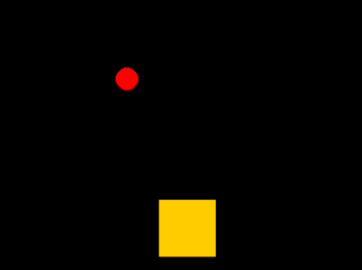

# Space Ball
Space Ball, is a game that we control ball with a airplane that is a orange square.<br>
This is version 1 of the Space Ball.

<p align="center">

</p>

* * *

# Requirements
* You should installed Python on your windows : [Install Python](https://www.python.org/)
* You should installed Required libraries

## Required libraries
* Copy this texts & paste on your terminal,
Then open the game.

### pygame

```
pip install pygame
```

### sys
* This library is installed on your Windows by default!
* When you install that you see the error.

* * *

## Thanks!
* Thanks to see my project
* Don't forget to try the game, "Space Ball v1".
* Bye!

- Ilia Asadi
